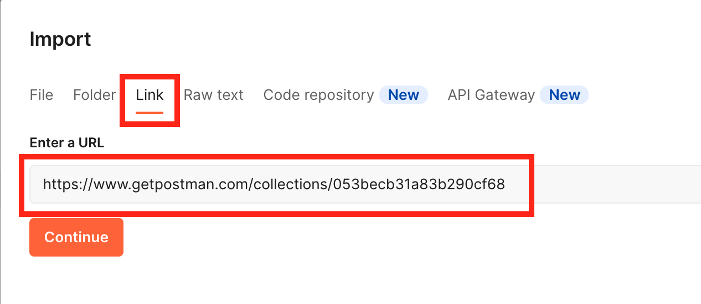
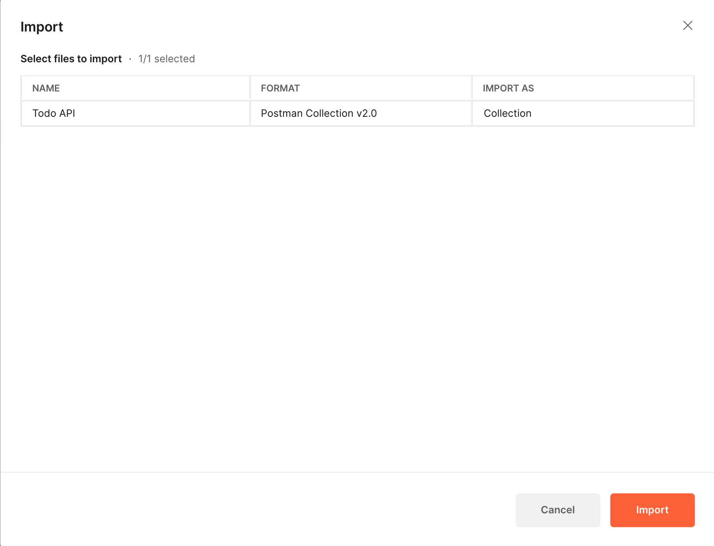
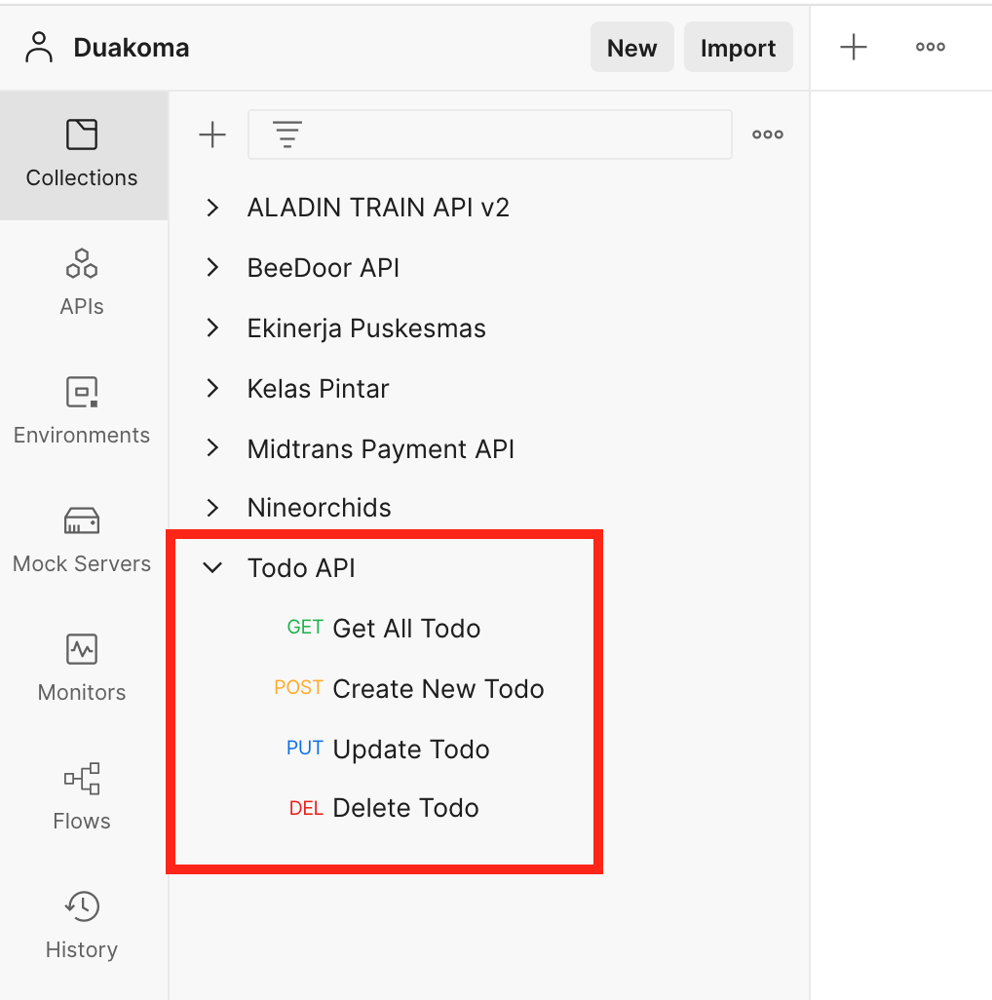
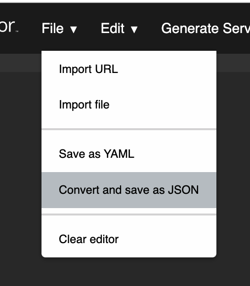

Ini kira-kira hasil dari Quizz 1 kita. Untuk cara melihat hasil nya bisa:

1. Lakukan [Project Setup](#project-setup)
2. Kemudian bisa buka disini [http://localhost:3000/api-docs](http://localhost:3000/api-docs)

## Edit Swagger Documentation

Untuk edit/update Dokumentasi API menggunakan swagger, kalian bisa langsung edit di projek ini, pada file [todo-api-documentation.json](./todo-api-documentation.json).

Atau bisa juga edit di swagger editor, dengan cara:

1. Buat dokumentasi bisa langsung di [https://editor.swagger.io/](https://editor.swagger.io/).
2. Setelah dokumentasi selesai dibuat, lalu pilih **File** > **Import File** > pilih file [todo-api-documentation.json](./todo-api-documentation.json) yang ada di projek kita tadi.
3. Dan kalian bisa merubah Dokumentasi API tadi sesuai kebutuhan.
4. Setelah selesai, kalian bisa lakukan export kembali dengan cara, pilih **File** > **Convert and Save as JSON**
5. Selanjut nya file hasil export nya, kalian bisa copy kan lagi ke projek ini, dan Dokumentasi API [http://localhost:3000/api-docs](http://localhost:3000/api-docs) sudah berubah.

<hr>

Ini adalah repository RESTful API yang menjadi basis untuk teman-teman membuat `Documentation API dengan Swagger`. Ikuti petunjuk di bawah dengan seksama untuk memastikan teman-teman dapat menjalankan RESTful API.

## Project setup

1. Clone Repository ini.

    ```bash
    $ git clone git@github.com:miqbalhamdani/todos-api.git
    ```
2. Masuk ke dalam Repository yang sudah di clone tadi.

    ```bash
    $ cd todos-api
    ```
3. Install dependencies

    ```bash
    $ npm install
    ```
4. Setup konfigurasi dari sequelize nya, pada file ini [config/config.json](config/config.json).

    ```json
    {
      "development": {
        "username": "miqbal", // di sesuaikan dengan username teman-teman
        "password": null,  // di sesuaikan dengan username
        "database": "todo_api",
        "host": "127.0.0.1",
        "dialect": "postgres"
      },
    }
    ```
5. Membuat database baru

    ```bash
    $ sequelize db:create
    ```
6. Menjalankan migration

    ```bash
    $ sequelize db:migrate
    ```
7. Menjalankan seeder

    ```bash
    $ sequelize db:seed:all
    ```
8. Terakhir, kita bisa menjalankan project dengan:

    ```bash
    $ npm run start
    ```

## Postman Collection

> https://www.getpostman.com/collections/053becb31a83b290cf68

Cara Import Postman Collection

1. Pilih Import

    
2. Pilih tab **link** > lalu masukan URL di atas > terkahir klik **Continue**

    
3. Pada bagian ini, bisa langsung di klik **Import** saja

    

4. Terakhir, apabila sudah berhasil import, maka akan ada tambahan **Todo Collection** pada sidebar sebelah kiri seperti di bawah ini

    

## Task

Membuat dokumentasi API dengan Swagger

1. Baca code repository RESTful API ini baik-baik
2. Buat dokumentasi untuk semua endpoint yang terdaftar di router
3. Dokumentasi melingkupi :
    - [ ] HTTP method
    - [ ] URL
    - [ ] URL parameter (jika ada)
    - [ ] Query parameter (jika ada)
    - [ ] Request body (jika ada)
    - [ ] format response


## Petunjuk Pengerjaan

1. Buat dokumentasi bisa langsung di [https://editor.swagger.io/](https://editor.swagger.io/).
2. Setelah dokumentasi selesai dibuat, lalu pilih **File** > **Convert and Save as JSON**

    
3. Upload file JSON tadi, di GIT kalian masing masing. (untuk repository nya kalo bisa di set public saja)
4. Upload link git ke [Google Form](https://forms.gle/vgzZPq9aPtdidnqz9)


> Quiz di submit paling lambat hari sabtu tanggal **14 Mei 2020, pukul 18:59 WIB**.

